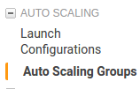
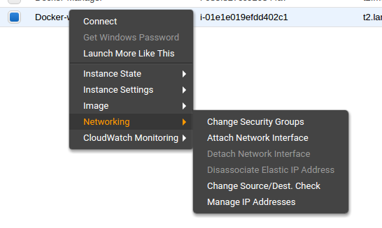
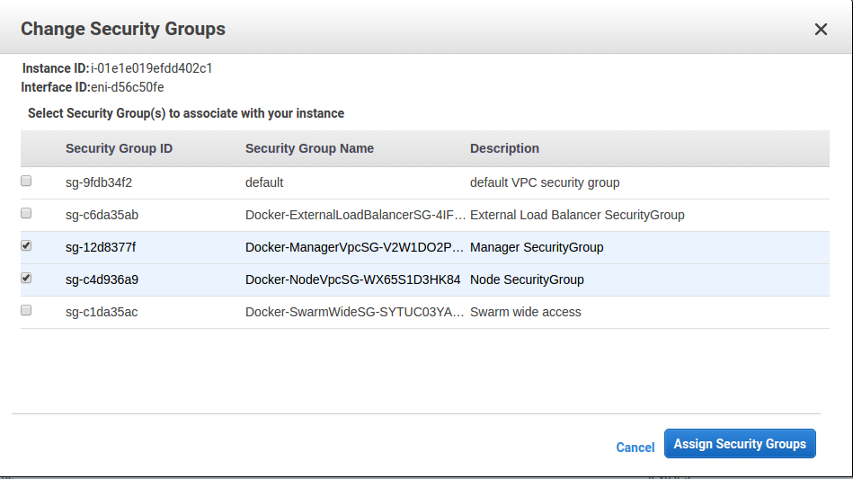
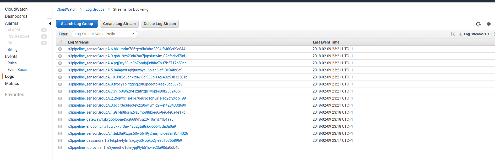
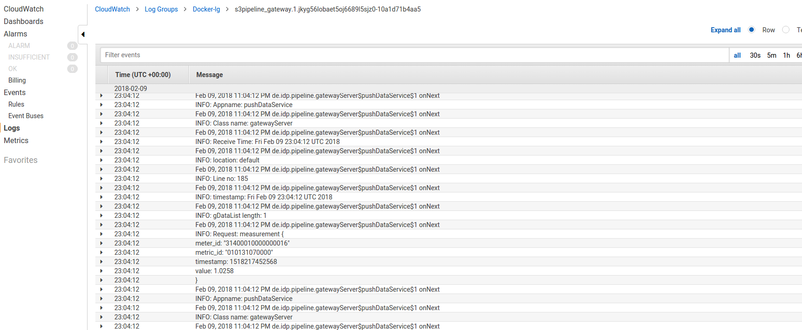

# Howtos for topology deployment

## Create your benchmark topology
The topology has to be specified into a docker compose file that is deployable by docker swarm:

### Header / Basic Services
Add this to the top of your compose file, you will need this on every deployment
```
version: '3'

volumes:
    provenancesensordata:
        external: true

services:
    cassandra:
        image: cassandra:latest

    idprovider:
        image: cloudproto/idprovider:latest
        environment:
            - START_ID=31400010000000000
```
### Sensor Groups
To add a sensor group add:
```
sensorGroupA:
        image: cloudproto/sensor:latest
        volumes:
            - provenancesensordata:/mnt
        environment:
            - SENSOR_PARAMETERS=-sourceFolder /mnt/oneday -sensorIdProvider idprovider:8080 -frequency 1000 -targetAddress gateway:50051 -targetType grpc-pipeline
            - STARTUP_DELAY=30
```
* *SensorGroupA* : just a servicename, modify it to your needs
* STARTUP_DELAY : wait n seconds until the sensor is retrieving data.
* SENSOR_PARAMETER: for available parameters look at https://gitlab.tu-berlin.de/dominik-ernst/smemu

* if you want to use data from the s3 bucket, don't change these parameters: ```-sourceFolder /mnt/oneday -sensorIdProvider idprovider:8080 ```) --> **scale with unique sensors possible**
* if you want to use a file that is stored inside the image, remove the ```-sensorIdProvider``` entry and change sourcefolder-entry to ```-sourceFolder data/20170210``` --> **scale only with the same sensordata/sensorId is possible**

To specify the next hop of the sensor, specify the parameter: ```-targetAddress```. The receiver of sensordata is another service that also defined in the compose file 
(int this example, we call our service ```gateway```).

### Pipeline Components
To add a Pipeline Component (Gateway/Endpoint) enter:
```
gateway:
    image: cloudproto/pipeline_component:latest
    environment:
        - CASSANDRA_HOST=cassandra
        - NODE_ID=000001
        - NODE_NAME=gateway
        - ARGUMENTS=--port 50051 --host_next endpoint --port_next 50051
        - STARTUP_DELAY=20
```

For this service, we choose ```gateway```, but you can name it as you want.

At the environment section, you can specify all fields that are also specified in the provenance.properties:

for example:
```
NODE_ID=000000
NODE_NAME=NONAME
SUCCESSOR=000000
NEIGHBOURS=000000:127.0.0.1
SINK=cassandra
CASSANDRA_HOST=127.0.0.1
CASSANDRA_PORT=9042
CASSANDRA_KEYSPACE_NAME=provenancekey
CASSANDRA_TABLE_NAME=provenancetable
CASSANDRA_REPLICATION_STRATEGY=SimpleStrategy
CASSANDRA_REPLICATION_FACTOR=1
BUFFER_CAPACITY=10
METRICS=meterid,metricid,loc,line,class,app,ctime,stime,rtime
```

In ```ARGUMENTS``` you can specify the parameter that are passed to the pipeline component:
for example:
```ARGUMENTS=--port 50051 --host_next endpoint --port_next 50051```

* ```endpoint``` is the next node in the topology that is also specified as a service in the compose file (like this service ```gateway```).

If you like to run a service as an endpoint (no next hop), just replace the ```ARGUMENTS``` variable with: 
* ```ARGUMENTS=--port 50051 (no next hop)```


You can vary these blocks to create complex topologies. Just copy the block, change the servicenames and define dependencies.

## Topoplogy Example
A simple topology: 
```
sensorGroupA -> gatewayA ------
                                --> endpoint    
sensorGroupB -> gatewayB ------
```
as docker compose would look like:
```
version: '3'

volumes:
    provenancesensordata:
        external: true

services:
    cassandra:
        image: cassandra:latest

    idprovider:
        image: cloudproto/idprovider:latest
        environment:
            - START_ID=31400010000000000

    sensorGroupA:
            image: cloudproto/sensor:latest
            volumes:
                - provenancesensordata:/mnt
            environment:
                - SENSOR_PARAMETERS=-sourceFolder /mnt/oneday -sensorIdProvider idprovider:8080 -frequency 1000 -targetAddress gatewayA:50051 -targetType grpc-pipeline
                - STARTUP_DELAY=30

    sensorGroupB:
            image: cloudproto/sensor:latest
            volumes:
                - provenancesensordata:/mnt
            environment:
                - SENSOR_PARAMETERS=-sourceFolder /mnt/oneday -sensorIdProvider idprovider:8080 -frequency 1000 -targetAddress gatewayB:50051 -targetType grpc-pipeline
                - STARTUP_DELAY=30

    gatewayA:
        image: cloudproto/pipeline_component:latest
        environment:
            - CASSANDRA_HOST=cassandra
            - NODE_ID=000001
            - NODE_NAME=gatewayA
            - ARGUMENTS=--port 50051 --host_next endpoint --port_next 50051
            - STARTUP_DELAY=20

    gatewayB:
        image: cloudproto/pipeline_component:latest
        environment:
            - CASSANDRA_HOST=cassandra
            - NODE_ID=000002
            - NODE_NAME=gatewayB
            - ARGUMENTS=--port 50051 --host_next endpoint --port_next 50051
            - STARTUP_DELAY=20

    endpoint:
        image: cloudproto/pipeline_component:latest
        environment:
            - CASSANDRA_HOST=cassandra
            - STARTUP_DELAY=20
            - ARGUMENTS=--port 50051
            - NODE_ID=000003
            - NODE_NAME=endpoint
```

Note: 
* You need to define the provenance properties ( mukrram(?) know how to configure it api comform)
* If some services fail at startup because other dependent nodes are not yet available, change the ```DELAY``` values in the environment sections of the nodes. 
* watch out for the correct indentation 

## AWS deployment 

This step is already done .. just for your information):

0.) Deploy the Stack on AWS. Followed this instructions to set up the docker-for-aws stack template.
* https://docs.docker.com/docker-for-aws/#docker-community-edition-ce-for-aws 
*https://console.aws.amazon.com/cloudformation/home#/stacks/new?stackName=Docker&templateURL=https://editions-us-east-1.s3.amazonaws.com/aws/stable/Docker.tmpl

Start your work:


### how to start / scale instances
1.) Login to AWS (EC2 View) you need the aws account for access (darshan or i will share with you):
- go to "Auto Scaling Groups"


- you see two groups :
    * for worker nodes ```Docker-NodeAsg-... ```
    * for manager nodes ```Docker-Manager-Asg-....```

- To start/increase the number of running instances select the group you want to change and click on ```"Edit"```
    * change the field ```"Desired"``` to the number of nodes you like to run
    * wait... the instances will scale up / down after a while (can take a few minutes)

2.) Install the ```rexray/s3fs``` volume plugin
    
* the ```rexray/s3fs``` has to be installed on all new worker instances to make the sensor data accessible (this is unfortunately a manual job)
    
* Attach the DockerManagerRole to worker instances to make the ssh access possible
    
* 
* 
    
    * ssh to every instance (yes!) and install the plugin by entering:
        ```docker plugin install rexray/s3fs:latest S3FS_ACCESSKEY=XXXXX S3FS_SECRETKEY=XXXXXX``` (replace with credentials)
    (this has to be done for every new instance e.g. when you scale up)

### how to deploy a topology ( docker compose file )
3.) login into EC2 Instance with name ```"Docker-Manager"```
    (you will need the "cloudproto.pem")
example: 
    
    ssh -i "cloudproto.pem" docker@ec2-18-195-31-223.eu-central-1.compute.amazonaws.com

4.) copy/paste the docker-compose file that contains you topoplogy to the manager

4.1) before deploying a stack (the compose file), check if other/old stacks still running by enter:

    docker stack ls

 if you want to delete currently running services then run:
    
    docker stack rm <service-name>

5.) Deploying the Stack:
        
        docker stack deploy -c <your_topology_yaml> <your_stack_name>
        (for example : docker stack deploy -c compose.yaml s3pipeline )

5.1) To show all running services get a list by enter:

    docker stack ps <servicename>

example:
    
    docker stack ps s3pipeline

output:
```
ID                  NAME                        IMAGE                                  NODE                                             DESIRED STATE       CURRENT STATE            ERROR                       PORTS
v1utyuk7tlf3        s3pipeline_endpoint.1       cloudproto/pipeline_component:latest   ip-172-31-18-32.eu-central-1.compute.internal    Running             Running 39 minutes ago
jkyg56lobaet        s3pipeline_gateway.1        cloudproto/pipeline_component:latest   ip-172-31-5-160.eu-central-1.compute.internal    Running             Running 38 minutes ago
w3yeredh61uk        s3pipeline_idprovider.1     cloudproto/idprovider:latest           ip-172-31-18-32.eu-central-1.compute.internal    Running             Running 39 minutes ago
z1ekphe4ytm3        s3pipeline_cassandra.1      cassandra:latest                       ip-172-31-5-160.eu-central-1.compute.internal    Running             Running 39 minutes ago
26qwrc1p41e7        s3pipeline_sensorGroupA.2   cloudproto/sensor:latest               ip-172-31-47-250.eu-central-1.compute.internal   Running             Running 35 minutes ago
```
6.) if you want to scale a service run:

    docker service scale <servicename>=<number> 

As example, we scale a service called "s3pipeline_sensorGroupA" (name consists of stackname and servicename) up/down to 10 containers:
```
~ $ docker service scale s3pipeline_sensorGroupA=10
s3pipeline_sensorGroupA scaled to 10
overall progress: 10 out of 10 tasks 
1/10: running   [==================================================>] 
2/10: running   [==================================================>] 
3/10: running   [==================================================>] 
4/10: running   [==================================================>] 
5/10: running   [==================================================>] 
6/10: running   [==================================================>] 
7/10: running   [==================================================>] 
8/10: running   [==================================================>] 
9/10: running   [==================================================>] 
10/10: running   [==================================================>] 
verify: Service converged 
```
Or scale it down again:
    
    docker service scale s3pipeline_sensorGroupA=1
```
s3pipeline_sensorGroupA scaled to 1
overall progress: 1 out of 1 tasks 
1/1: running   [==================================================>] 
verify: Service converged 
```
### how to observe logfiles
7.) Observe the output of every service instance:
The output is piped to CloudWatch logs. If you open CloudWatch you will see an entry for every service:




this can be opened to observer the output.

7.1 on the manager you can also run:

    docker stats 

to get a overview about used resources by every container:
```
CONTAINER ID        NAME                                               CPU %               MEM USAGE / LIMIT     MEM %               NET I/O             BLOCK I/O           PIDS
10a1d71b4aa5        s3pipeline_gateway.1.jkyg56lobaet5oj6689l5sjz0     2.28%               160.8MiB / 3.853GiB   4.07%               13.9MB / 41.4MB     0B / 98.3kB         44
ee51575b8969        s3pipeline_cassandra.1.z1ekphe4ytm3xgxyb3vopko2y   2.62%               1.194GiB / 3.853GiB   30.99%              55MB / 2.55MB       0B / 220MB          55
f2dc5e667bd7        l4controller-aws                                   0.03%               5.879MiB / 3.853GiB   0.15%               67.4kB / 34.5kB     0B / 0B             6
f747cf157bdc        meta-aws                                           0.00%               4.484MiB / 3.853GiB   0.11%               29.9kB / 10.6kB     0B / 0B             6
8940eb63afe2        guide-aws                                          0.95%               6.02MiB / 3.853GiB    0.15%               853kB / 533kB       27.6MB / 0B         2
635a4d414d1d        shell-aws                                          0.03%               7.324MiB / 3.853GiB   0.19%               285kB / 547kB       897kB / 8.19kB      13
```

### how to remove your stack
8.) if you are finished with you benchmark, go back to docker manager and remove your stack:

    docker stack rm <your_stack>

exmaple:
```
~ $ docker stack rm s3pipeline
Removing service s3pipeline_cassandra
Removing service s3pipeline_endpoint
Removing service s3pipeline_gateway
Removing service s3pipeline_idprovider
Removing service s3pipeline_sensorGroupA
Removing network s3pipeline_default
```


